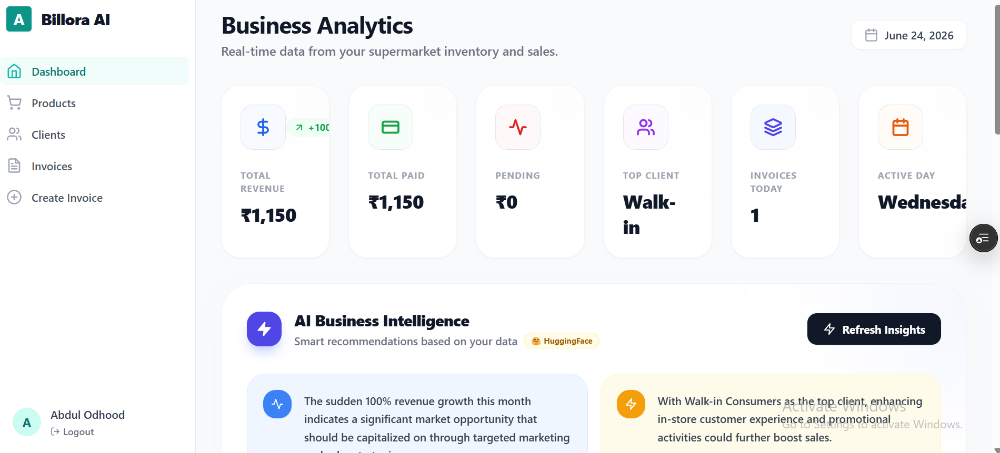
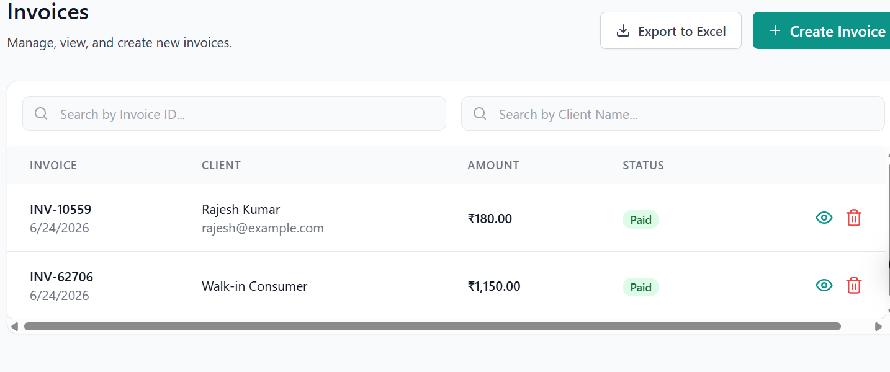
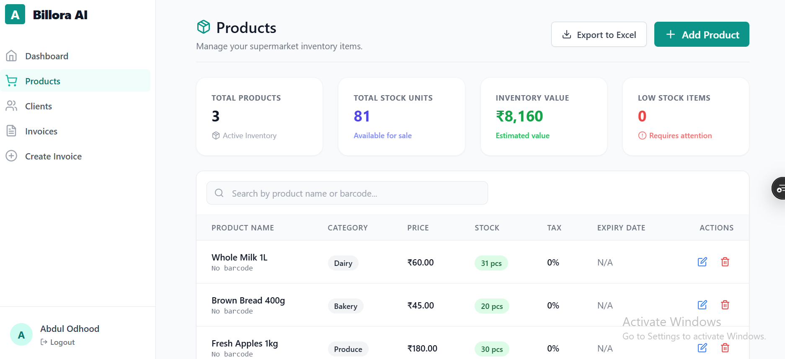

# 🚀 AI Invoice SaaS

<div align="center">


### Intelligent Invoice Management Platform with AI-Powered Business Insights

<p>
  <a href="YOUR_LIVE_URL">
    
  </a>

  <a href="https://github.com/YOUR_USERNAME/REPO_NAME">
    
  </a>
</p>

</div>

---

## 📖 Overview

AI Invoice SaaS is a modern invoice management system built with the MERN Stack. It helps businesses create invoices, manage products, track clients, monitor inventory, and gain AI-powered business insights.

---

## ✨ Features

### 🔐 Authentication

* Secure Login & Registration
* JWT Authentication
* Protected Routes
* User Session Management

### 📊 Dashboard Analytics

* Revenue Analytics
* Invoice Status Monitoring
* Inventory Tracking
* Top Customer Insights
* Product Performance

### 🧾 Invoice Management

* Create Invoices
* Edit Invoices
* Delete Invoices
* Invoice Search & Filtering
* Status Tracking

### 👥 Client Management

* Add New Clients
* Update Client Information
* Customer History Tracking

### 📦 Product Management

* Inventory Tracking
* Stock Management
* Low Stock Alerts
* Product Categories

### 🤖 AI Features

* AI Business Insights
* Revenue Analysis
* Business Recommendations
* Smart Invoice Assistance

### 📈 Export & Reporting

* Excel Export
* Revenue Reports
* Inventory Reports

---

## 🛠 Tech Stack

| Frontend      | Backend    | Database       | AI          |
| ------------- | ---------- | -------------- | ----------- |
| React.js      | Node.js    | MongoDB        | Gemini AI   |
| Tailwind CSS  | Express.js | MongoDB Atlas  | Google AI   |
| Redux Toolkit | JWT        | Mongoose       | AI Insights |
| Recharts      | REST API   | Cloud Database | Automation  |

---

## 📸 Screenshots

### Dashboard



### Invoice Management



### Product Management



---

## ⚡ Performance Optimizations

✅ Route-based Lazy Loading

✅ Dynamic XLSX Imports

✅ Code Splitting

✅ AI Insights Deferred Loading

✅ Optimized Dashboard Rendering

✅ Reduced Initial Bundle Size by 77%

---

## 🚀 Installation

### Clone Repository

```bash
git clone https://github.com/YOUR_USERNAME/REPO_NAME.git
cd REPO_NAME
```

### Install Dependencies

```bash
# Frontend
cd client
npm install

# Backend
cd ../server
npm install
```

### Configure Environment Variables

```env
PORT=5000

MONGODB_URI=YOUR_MONGODB_URI

JWT_SECRET=YOUR_SECRET

GEMINI_API_KEY=YOUR_API_KEY
```

### Run Project

```bash
# Backend
npm run dev

# Frontend
npm run dev
```

---

## 🌐 Live Demo

### 👉 [Visit AI Invoice SaaS](YOUR_LIVE_URL)

---

## 👨‍💻 Developer

**Abdul Wadu**

* Full Stack Developer
* MERN Stack Developer
* AI Application Developer

---

## ⭐ Support

If you like this project, please give it a ⭐ on GitHub.

---

<div align="center">

### Built with ❤️ using MERN Stack & AI

</div>
